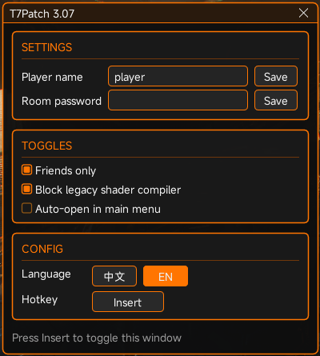

# T7Patch（d3d11.dll 代理版）

中文 | [English](README.en.md)

基于 [T7Patch](https://github.com/Scroptss/T7Patch-src) 开发。
T7Patch 是《使命召唤：黑色行动3》（BO3）的社区安全/反崩溃补丁。

## 补丁功能

- **联机防护**：拦截恶意数据包，抵御他人对你的攻击与干扰；非好友无法邀请你、拉你进房或与你互动
- **防崩溃**：抵御各类畸形数据包引发的游戏崩溃
- **缩小攻击面**：关闭创意工坊订阅与游戏内浏览器等高风险入口
- **性能优化**：消除 DLC 扫描引起的卡顿
- **界面汉化（mod 汉化）**：把游戏界面里的英文替换为中文词库
  - **一键更新词库**：在菜单里点「更新词库」联网取最新版，下载后约 2 秒生效，无需重启游戏
  - **按场景屏蔽**：可让「多人对局」「僵尸对局」保持英文（默认：**多人不翻译，僵尸照常翻译**）；
    屏蔽作用在**已经建立对局的场景**（房间、大厅也算在内），主菜单与战役不受影响
  - 游戏语言不是中文时，启动会自动关闭汉化（非中文版本没有中文字形，中文会显示成方框）
- **地图语言兼容**：兼容某些地图因为语言缺失无法进入的问题
- **可选的 Vulkan 渲染后端（DXVK）**：在菜单「图形」页一键获取（下载后自动校验文件完整性），
  再由旁边的开关启用、重启游戏生效；需要显卡驱动支持 Vulkan
- **游戏内控制面板**：进入主菜单后按 `Insert` 呼出菜单，可视化开关全部功能，支持中英切换

## 安装

1. 从 [Releases](../../releases) 页下载 `d3d11.dll`（或自行构建）
2. 关闭游戏，把 `d3d11.dll` 复制到游戏目录（与 `BlackOps3.exe` 同层）
3. 启动游戏，右上角出现 `Patch 3.09` 即安装成功；游戏目录会自动生成 `T7Patch\` 文件夹
4. **卸载**：删除该 `d3d11.dll`；若游戏目录里有 `dxgi.dll` 与 `d3d11_backend.dll`（DXVK）也一并删除，没有则忽略。
   另外旧着色器编译器开关打开时 `d3dcompiler_46.dll` 会被改名为 `.bak`，改回原名即可（该开关默认关闭）

## 游戏内菜单

进入主菜单后按 `Insert`（可在菜单里改）呼出控制面板：

分为三个页签：

- **常规**
  - **设置**：玩家昵称（默认显示游戏当前名字）、房间密码 —— 每行独立 `Save` 提交
  - **开关**：仅好友可加入（点击即生效）、隔离旧着色器编译器（默认关，文件改名，下次启动生效）、自动打开窗口
  - **配置**：中英文切换、呼出快捷键自定义（点按钮后按新键，`ESC` 取消）
- **图形**：可选渲染后端 DXVK —— 获取 / 启用，以及 HUD 元素、帧率上限、撕裂控制
- **更多**：**mod 汉化**开关 + 「更新词库」按钮；其下两个缩进子开关 ——
  **关闭多人对局翻译**（默认开）、**关闭僵尸对局翻译**（默认关），只在「mod 汉化」打开时可点
- 菜单打开时游戏输入被屏蔽，不会误操作角色；关闭时对游戏零干扰
- 快捷键只在**主菜单真正出现后**才生效（标题界面、连接界面按了没反应），避免启动阶段误触

## 配置

编辑 `T7Patch\t7patch.conf`（保存后约 1 秒内热生效，无需重启游戏）：

| 键 | 说明 |
|---|---|
| `playername=` | 留空 = 使用游戏当前昵称；填值 = 覆盖游戏内昵称 |
| `isfriendsonly=` | `1` = 仅好友可加入/互动（推荐） |
| `networkpassword=` | 房间密码，配合仅好友使用 |
| `block_d3dcompiler46=` | `1` = 启动时把 `d3dcompiler_46.dll` 改名成 `.dll.bak`（默认关闭，菜单里也可切换） |
| `menu_key=` | 呼出菜单的虚拟键码（默认 `45` = Insert） |
| `menu_auto_open=` | `1` = 识别到主菜单后约 1.5 秒自动打开菜单（默认 `1`） |
| `menu_lang=` | `1` = 中文（默认），`0` = English |
| `translate=` | `1` = 把界面英文文本替换为模组汉化词库（默认关闭，菜单里也可切换）；游戏语言不是中文时，启动会自动关掉它并把这一项改回 `0` |
| `skip_pvp=` | `1` = 多人对局不翻译（默认 `1`）。主菜单不受影响；需 `translate=1` |
| `skip_zm=` | `1` = 僵尸对局不翻译（默认 `0`）。战役不受影响；需 `translate=1` |
| `dev_tools=` | `1` = **开发工具模式**：采集界面英文文本。默认关闭，**不放进菜单**，属开发工具。旧键名 `dump_ui_strings` 仍会被读取，下次重写配置时自动改成新名 |

**从旧版本升级**：不需要手动改配置文件。旧文件里没有的项一律按上表默认值生效，
补丁启动时还会把文件**自动重写成当前格式** —— 只补全缺失的项和注释，**已有设置的值不变**。

## 致谢

- 原始项目：[shiversoftdev/t7patch](https://github.com/shiversoftdev/t7patch)
- 源码上游：[Scroptss/T7Patch-src](https://github.com/Scroptss/T7Patch-src)
- DXVK：[doitsujin/dxvk](https://github.com/doitsujin/dxvk)
